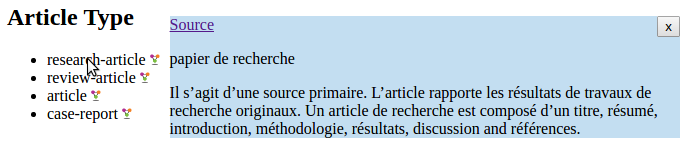

# lodex-widget
Web widget to enrich your resources with LODEX resources

## Installation

Require the [lodex-widget.js](https://rawgit.com/Inist-CNRS/lodex-widget/master/lodex-widget.js) script from your HTML page:

```html
<html>
<head>
    <script type="text/javascript" src="lodex-widget.js"></script>
</head>
<body>
</body>
</html>
```

## Usage

```html
<ul id="article-types">
    <li><span class="facet" about="http://article-type.lod.istex.fr/=/research-article" property="dc:identifier">
        research-article
    </span></li>
    <li><span class="facet" about="http://article-type.lod.istex.fr/=/review-article" property="dc:identifier">
        review-article
    </span></li>
    <li><span class="facet" about="http://article-type.lod.istex.fr/=/article" property="dc:identifier">
        article
    </span></li>
    <li><span class="facet" about="http://article-type.lod.istex.fr/=/case-report" property="dc:identifier">
        case-report
    </span></li>
</ul>
```

```javascript
// example usage
var LodexWidget = require('lodex-widget');
var lw = new LodexWidget('#article-types .facet');
lw.add();
```


## Complete example

```html
<!DOCTYPE html>
<html>

<head>
    <title>Lod Widget test</title>
    <script src="./lodex-widget.js"></script>
</head>

<body>

    <h2>Article Type</h2>
    <ul id="article-types">
        <li><span class="facet" about="http://article-type.lod.istex.fr/=/research-article" property="dc:identifier">
            research-article
        </span></li>
        <li><span class="facet" about="http://article-type.lod.istex.fr/=/review-article" property="dc:identifier">
            review-article
        </span></li>
        <li><span class="facet" about="http://article-type.lod.istex.fr/=/article" property="dc:identifier">
            article
        </span></li>
        <li><span class="facet" about="http://article-type.lod.istex.fr/=/case-report" property="dc:identifier">
            case-report
        </span></li>
    </ul>

    <script type="text/javascript">
var LodexWidget = require('lodex-widget');
var lw = new LodexWidget('#article-types .facet');
lw.add();
    </script>

</body>

</html>
```



## LodexWidget

### items selector
*Required parameter*

CSS selector pointing to the items to enrich.
The pointed elements must have an `about` attribute required.

Example: `#articles-types .facet`

### JBJ stylesheet
*Optional parameter*

A [JBJ](https://github.com/Inist-CNRS/node-jbj) stylesheet, which returns a
string (possibly in HTML), to be displayed in the tooltip.

The stylesheet is applied to the [JSON-LD](http://json-ld.org) returned by the
URL contained in the `about` attribute of the items selected.

**Example of JSON-LD**:

```json
[
    {
        "@id":"http://article-type.lod.istex.fr/=/research-article",
        "@context":{
            "_wid":{"@id":"http://purl.org/dc/elements/1.1/identifier"},
            "_description":{"@id":"http://purl.org/dc/terms/identifier"},
            "c3":{"@id":"http://purl.org/dc/terms/title"},
            "c4":{"@id":"http://www.w3.org/2008/05/skos-xl#prefLabel","@language":"fr"},
            "c5":{"@id":"http://www.w3.org/2008/05/skos-xl#prefLabel","@language":"en"},
            "c6":{"@id":"http://www.w3.org/2004/02/skos/core#definition","@language":"fr"},
            "c7":{"@id":"http://www.w3.org/2004/02/skos/core#definition","@language":"en"},
            "c8":{"@id":"http://www.w3.org/2004/02/skos/core#note"},
            "c9":{"@id":"http://www.w3.org/2004/02/skos/core#scopeNote"},
            "c10":{"@id":"http://www.w3.org/2004/02/skos/core#example"},
            "c11":{"@id":"http://purl.org/dc/terms/created"},
            "c12":{"@id":"http://purl.org/dc/terms/modified"}
        },
        "_wid":"research-article",
        "_description":"research-article",
        "c3":"research-article",
        "c4":"papier de recherche",
        "c5":"research article",
        "c6":"Il s'agit d'une source primaire. L'article rapporte les résultats de travaux de recherche originaux. Un article de recherche est composé d'un titre, résumé, introduction, méthodologie, résultats, discussion and références.",
        "c7":"Primary source. Article reporting on primary research (The related value review-article describes a literature review, research summary, or state-of-the-art article). Source : DTD NLM 3.0 (<a href=\"http://dtd.nlm.nih.gov/archiving/tag-library/3.0/index.html?attr=article-type\">http://dtd.nlm.nih.gov/archiving/tag-library/3.0/index.html?attr=article-type</a>)",
        "c8":"Le type 'research-article' regroupe différents intitulés qui varient selon l'éditeur, la discipline, voire la revue. ",
        "c9":"Cette catégorisation émane du type d'article original fourni par l'éditeur. Attention, rien ne vaut la lecture d'un article pour en mesurer le contenu et la qualité ! ",
        "c10":"original paper, research, categtxt,",
        "c11":"26/06/2016",
        "c12":"2016-05-30T13:07:16.899Z"
    }
]
```

**Default stylesheet**:

```json
{
  "get": 0,
  "$label": {
    "getJsonLdField": "http://www.w3.org/2008/05/skos-xl#prefLabel",
    "get": "content"
  },
  "$description": {
    "getJsonLdField": "http://www.w3.org/2004/02/skos/core#definition",
    "get": "content"
  },
  "mask": "label,description",
  "template": "<p>{{label}}</p>\n<p>{{description}}</p>"
}
```

This stylesheet creates two new fields (`label` and `description`), using
[`getJsonLdField`](https://github.com/Inist-CNRS/node-jbj-rdfa#getJsonLdField)
to select the field in JSON-LD which id is given in parameter.

Then, it takes the `content` field of what's returned, and select only `label`
and `description` using the `mask` action.

The [`template`](https://github.com/Inist-CNRS/node-jbj-template#template)
action then creates the HTML which will be displayed within the tooltips.

The best way to see what will be produced by the stylesheet is to use the [JBJ-Playground](http://inist-cnrs.github.io/jbj-playground/?input=http://article-type.lod.istex.fr/=/research-article?alt=jsonld).

## add
LodexWidget's method, to add the tooltips in the page.

### options
Object containing all options.

#### persistent
*boolean*
*default value: false*

If `true`, the tooltip won't hide when the mouse leaves its item's zone.
It hides when the mouse enter the zone of another item.
